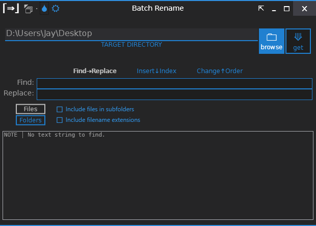

# Batch Rename (WPF)
**Last Updated:** 13 August 2014

This is the code repository for a WPF app called "Batch Rename". 
It's purpose is a to batch rename files.

OPTIONS:
- Basic Find and Replace
- Insert string at index
- Change order of strings (based on delimiter)

This app uses my own Window template which includes:
- Dark/White Theme
- Color Schemes
- Always On-Top option.
- In-place Collapse/Expand

**NOTE:** I still use this app to this day.
